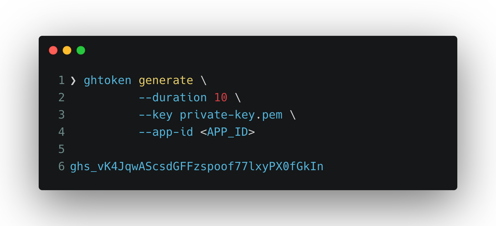
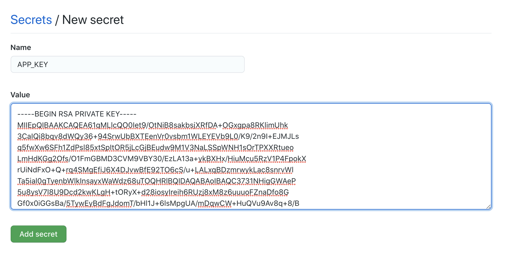

# GH Token

```sh
* _____ _   *_   _______ *  _      *  *    **   *
 / ____| |* | | |__   __|  | |  *       *         🦄  *
| | *__| |_*| | ⭐️ | | ___ | | _____*_ __  *     *
| | |_ |* __ *|    |*|/ _ \| |/ / _ \ '_ \     *   *
| |__| | |  | | *  | | (_)*|   <  __/ | | |  *
 \_____|_|  |_|    |_|\___/|_|\_\___|_| |_|   *
```

<!-- markdownlint-disable -->

> Create an installation access token for a GitHub app from your terminal

[](ghtoken) [](LICENSE) 
<!-- markdownlint-restore -->

[Creates an installation access token](https://docs.github.com/en/rest/reference/apps#create-an-installation-access-token-for-an-app) that enables a GitHub App to make authenticated API requests for the app's installation on an organization or individual account.
Installation tokens expire 1 hour from the time you create them. Using an expired token produces a status code of `401 - Unauthorized`, and requires creating a new installation token.

You can use this access token to make pretty much any REST or GraphQL API call the app is authorized to make!



<details>
  <summary>Expand for Demo</summary>

  

</details>

## Why?

In order to use GitHub's [REST](https://docs.github.com/en/rest) or [GraphQL](https://docs.github.com/en/graphql) APIs you will need either a [Personal Access Token](https://docs.github.com/en/developers/apps/about-apps#personal-access-tokens) (PAT) or a [GitHub App](https://docs.github.com/en/developers/apps/about-apps#about-github-apps).

**PATs are dangerous, they:**

1. have a very wide scope that spans across multiple organizations
1. never (automatically) expire. They have an indefinite lifetime (or at least until you regenerate them)
1. cannot be revoked (they're only revoked when a new one is generated)

With an access token generated with a GitHub App you don't have to worry about the concerns above. These tokens have a limited scope and lifetime. Just make sure you handle the token safely (avoid leaking). In the worst case scenario, the token will expire in 1 hour from creation time.

## Installation

### Prerequisites

- `Bash 5.x+`
- `jq`
- `shasum`

Download `ghtoken` [from the main branch](https://github.com/Link-/gh-token/blob/main/gh-token)

### wget

```sh
# Download a file, name it ghtoken then do a checksum
wget -O ghtoken \
    https://raw.githubusercontent.com/Link-/gh-token/main/gh-token && \
    echo "11630050d3859d7fcaa42fad08c184cfe2ceeb3887779dc76394c4dba80903ef  ghtoken" | \
    shasum -c - && \
    chmod u+x ./ghtoken
```

### curl

```sh
# Download a file, name it ghtoken following [L]ocation redirects, and
# automatically [C]ontinuing (resuming) a previous file transfer then
# do a checksum
curl -o ghtoken \
     -O -L -C  - \
     https://raw.githubusercontent.com/Link-/gh-token/main/gh-token && \
     echo "11630050d3859d7fcaa42fad08c184cfe2ceeb3887779dc76394c4dba80903ef  ghtoken" | \
     shasum -c - && \
     chmod u+x ./ghtoken
```

### gh cli extension

You can install `ghtoken` as a [gh cli](https://github.com/cli/cli) extension!

```sh
gh extensions install Link-/gh-token

# Verify installation
gh token
```

All the commands and parameters remain the same, the only different is you now can use `gh token` instead of `ghtoken`.

### Creating a GitHub App

Follow [these steps](https://docs.github.com/en/developers/apps/creating-a-github-app)

## Usage

Compatible with [GitHub Enterprise Server](https://github.com/enterprise).

```text

Usage:
  ghtoken generate (--key <key> | --base64_key <key>) --app_id <id> [--duration <minutes>] [--installation_id <id>] [--hostname <hostname>] [--install_jwt_cli]
  ghtoken installations (--key <key> | -base64_key <key>) --app_id <id> [--duration <minutes>] [--hostname <hostname>] [--install_jwt_cli]
  ghtoken revoke --token <token> [--hostname <hostname>]
  ghtoken -h | --help
  ghtoken --version

Options:
  -h --help  Display this help information.
  --version  Display version information.
  -k <key>, --key <key>                 Path to a PEM-encoded certificate and key. [required]
  -b <key>, --base64_key <key>          Base64 encoded PEM certificate and key. [optional]
  -i <id>, --app_id <id>                GitHub App Id. [required]
  -d <minutes>, --duration <minutes>    The expiration duration of the JWT in minutes. [default: 10]
  -o <hostname>, --hostname <hostname>  The API URL of GitHub. [default: api.github.com]
  -j, --install_jwt_cli                 Install jwt-cli (dependency) on the current system. [optional]
  -l <id>, --installation_id <id>       GitHub App installation id. [default: latest id]
  -t <token>, --token <token>           Access token to revoke. [required]
```

### Examples in the Terminal

#### Run `ghtoken` assuming `jwt-cli` is already installed

```sh
# Assumed starting point
.
├── .keys
│   └── private-key.pem
├── README.md
└── ghtoken

1 directory, 3 files

# Run ghtoken
$ ghtoken generate \
    --key ./.keys/private-key.pem \
    --app_id 1122334 \
    | jq

{
  "token": "ghs_g7___MlQiHCYI__________7j1IY2thKXF",
  "expires_at": "2021-04-28T15:53:44Z"
}
```

#### Run `ghtoken` and install `jwt-cli`

```sh
# Assumed starting point
.
├── .keys
│   └── private-key.pem
├── README.md
└── ghtoken

1 directory, 3 files

# Run ghtoken and add --install_jwt_cli
$ ghtoken generate \
    --key ./.keys/private-key.pem \
    --app_id 1122334 \
    --install_jwt_cli \
    | jq

{
  "token": "ghs_8Joht_______________bLCMS___M0EPOhJ",
  "expires_at": "2021-04-28T15:55:32Z"
}

# jwt-cli will be downloaded in the same directory
.
├── .keys
│   └── private-repo-checkout.2021-04-22.private-key.pem
├── README.md
├── ghtoken
└── jwt
```

#### Run `ghtoken` and pass the key as a base64 encoded variable

```sh
# Assumed starting point
.
├── README.md
└── ghtoken

1 directory, 2 files

# Run ghtoken and add --install_jwt_cli
$ ghtoken generate \
    --base64_key $(printf "%s" $APP_KEY | base64) \
    --app_id 1122334 \
    --install_jwt_cli \
    | jq

{
  "token": "ghs_GxVel5cp__________DOaCv8eDs___2l94Ta",
  "expires_at": "2021-04-28T16:30:59Z"
}
```

#### Run `ghtoken` with GitHub Enterprise Server

```sh
# Assumed starting point
.
├── .keys
│   └── private-key.pem
├── README.md
└── ghtoken

1 directory, 3 files

# Run ghtoken and specify the --hostname
$ ghtoken generate \
    --key ./.keys/private-key.pem \
    --app_id 2233445 \
    --installation_id 5 \
    --install_jwt_cli \
    --hostname "github.example.com" \
    | jq

{
  "token": "v1.bb1___168d_____________1202bb8753b133919",
  "expires_at": "2021-04-28T16:01:05Z"
}
```

#### Fetch list of installations for an app

```sh
# Assumed starting point
.
├── .keys
│   └── private-key.pem
├── README.md
└── ghtoken

1 directory, 3 files

# Run ghtoken and specify the --hostname
$ ghtoken installations \
    --key ./.keys/private-key.pem \
    --app_id 2233445 \
    --install_jwt_cli \
    --hostname "github.example.com" \
    | jq
```

<details>
  <summary>Response</summary>

  ```json
  [
    {
      "id": 1,
      "account": {
        "login": "octocat",
        "id": 1,
        "node_id": "MDQ6VXNlcjE=",
        "avatar_url": "https://github.com/images/error/octocat_happy.gif",
        "gravatar_id": "",
        "url": "https://api.github.com/users/octocat",
        "html_url": "https://github.com/octocat",
        "followers_url": "https://api.github.com/users/octocat/followers",
        "following_url": "https://api.github.com/users/octocat/following{/other_user}",
        "gists_url": "https://api.github.com/users/octocat/gists{/gist_id}",
        "starred_url": "https://api.github.com/users/octocat/starred{/owner}{/repo}",
        "subscriptions_url": "https://api.github.com/users/octocat/subscriptions",
        "organizations_url": "https://api.github.com/users/octocat/orgs",
        "repos_url": "https://api.github.com/users/octocat/repos",
        "events_url": "https://api.github.com/users/octocat/events{/privacy}",
        "received_events_url": "https://api.github.com/users/octocat/received_events",
        "type": "User",
        "site_admin": false
      },
      "access_tokens_url": "https://api.github.com/installations/1/access_tokens",
      "repositories_url": "https://api.github.com/installation/repositories",
      "html_url": "https://github.com/organizations/github/settings/installations/1",
      "app_id": 1,
      "target_id": 1,
      "target_type": "Organization",
      "permissions": {
        "checks": "write",
        "metadata": "read",
        "contents": "read"
      },
      "events": [
        "push",
        "pull_request"
      ],
      "single_file_name": "config.yaml",
      "has_multiple_single_files": true,
      "single_file_paths": [
        "config.yml",
        ".github/issue_TEMPLATE.md"
      ],
      "repository_selection": "selected",
      "created_at": "2017-07-08T16:18:44-04:00",
      "updated_at": "2017-07-08T16:18:44-04:00",
      "app_slug": "github-actions",
      "suspended_at": null,
      "suspended_by": null
    }
  ]
  ```

</details>

#### Revoke an installation access token

```sh
# Run ghtoken with the revoke command
$ ghtoken revoke \
    --token "v1.bb1___168d_____________1202bb8753b133919"
    --hostname "github.example.com"

204: Token revoked successfully
```

#### Integrate with [GitHub's CLI](https://github.com/cli/cli)

You can use ghtoken alongside [gh cli](https://github.com/cli/cli) by setting these aliases:

```sh
# Add ghtoken to a folder included in your PATH environment variable
ln -s <PATH TO THE SCRIPT>/ghtoken /usr/local/bin/ghtoken

# Set a token generation alias. This will always generate a token from
# the app ID and key supplied.
$ gh alias set token -s 'ghtoken generate --key /tmp/private-key.pem --app_id 112233'

# Usage
$ gh token

{
  "token": "ghs_1gCKrYvkh3_______7JZFlZw______w1FE",
  "expires_at": "2021-05-15T22:34:10Z"
}

# You can also set an alias to revoke tokens
$ gh alias set revokeToken -s 'ghtoken revoke --token "$1"'

# Usage
$ gh revokeToken "ghs_1gCKrYvkh3_______7JZFlZw______w1FE"

204: Token revoked successfully
```

### Example in a workflow

<details>

  <summary>Expand to show instructions</summary>

1. You need to create a secret to store the **applications private key** securely (this can be an organization or a repository secret):
    

1. You need to create another secret to store the **application id** security (same as the step above).

1. The secrets need to be provided as an environment variable then encoded into base64 as show in the workflow example:

This example is designed to run on GitHub Enterprise Server. To use the same workflow with GitHub.com update the hostname to `api.github.com` and change the API URL in the testing step.

```yaml
name: Create access token via GitHub Apps Workflow

on:
  workflow_dispatch:

jobs:
  Test:
    # The type of runner that the job will run on
    runs-on: [ self-hosted ]

    steps:
    - name: "Download ghtoken"
      run: |
        curl -o ghtoken \
             -O -L -C  - \
             https://raw.githubusercontent.com/Link-/gh-token/main/gh-token && \
             echo "11630050d3859d7fcaa42fad08c184cfe2ceeb3887779dc76394c4dba80903ef  ghtoken" | \
             shasum -c - && \
             chmod u+x ./ghtoken
    # Create access token with a GitHub App ID and Key
    # We use the private key stored as a secret and encode it into base64
    # before passing it to ghtoken
    - name: "Create access token"
      id: "create_token"
      run: |
        token=$(./ghtoken generate \
          --base64_key $(printf "%s" "$APP_PRIVATE_KEY" | base64 -w 0) \
          --app_id $APP_ID \
          --install_jwt_cli \
          --hostname "github.example.com" \
          | jq -r ".token")
        echo "::set-output name=token::$token"
      env:
        APP_ID: ${{ secrets.APP_ID }}
        APP_PRIVATE_KEY: ${{ secrets.APP_KEY }}
    # To test the token we will use it to fetch the list of repositories
    # belonging to our organization
    - name: "Fetch organization repositories"
      run: |
        curl -X GET \
          -H "Authorization: token ${{ steps.create_token.outputs.token }}" \
          -H "Accept: application/vnd.github.v3+json" \
          https://github.example.com/api/v3/orgs/<ORGNAME>/repos
```

</details>

## Troubleshoot

### I'm getting: `Something went awry creating the jwt` with `ghtoken generate`

Make sure your `pem` file has the extension `.pem`. This is necessary for `jwt-cli` to be able to determine the type of key it's trying to parse.

#### I get `null` values for `token` and `expiration date`

If you see this response:

```sh
{
  "token": null,
  "expires_at": null
}
```

This is an indication that the script was not able to fetch an `installation id` and that the GitHub App has not been `installed` for an Organization or User.

#### I get a weird syntax error

Make sure you're running `bash 5.x+`. If you're running MacOS, the version of `bash` installed is `3.2` which is not compatible with this tool.

```sh
# Upgrade bash and that should resolve your problem
brew upgrade bash
```

## Similar projects

_These are not endorsements, just a listing of similar art work_

### CLI

- [apptokit](https://github.com/jakewilkins/apptokit) in Ruby
- [gha-token](https://github.com/slawekzachcial/gha-token) in Go

### Actions

- [workflow-application-token-action](https://github.com/peter-murray/workflow-application-token-action)
- [action-github-app-token](https://github.com/getsentry/action-github-app-token)
- [github-app-token-generator](https://github.com/navikt/github-app-token-generator)
