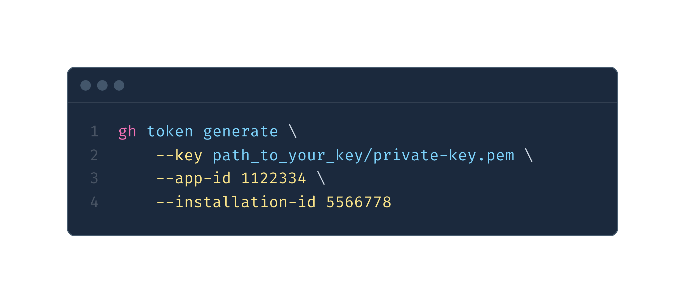

# GH Token

```shell
* _____ _   *_   _______ *  _      *  *    **   *
 / ____| |* | | |__   __|  | |  *       *         🦄  *
| | *__| |_*| | ⭐️ | | ___ | | _____*_ __  *     *
| | |_ |* __ *|    |*|/ _ \| |/ / _ \ '_ \     *   *
| |__| | |  | | *  | | (_)*|   <  __/ | | |  *
 \_____|_|  |_|    |_|\___/|_|\_\___|_| |_|   *
```

<!-- markdownlint-disable -->

> Manage installation access tokens for GitHub apps from your terminal

[](LICENSE)

<!-- markdownlint-restore -->

[Creates an installation access token](https://docs.github.com/en/rest/reference/apps#create-an-installation-access-token-for-an-app) to make authenticated API requests.

Installation tokens expire **1 hour** from the time you create them. Using an expired token produces a status code of `401 - Unauthorized`, and requires creating a new installation token.

You can use this access token to make pretty much any REST or GraphQL API call the app is authorized to make!



## Why?

In order to use GitHub's [REST](https://docs.github.com/en/rest) or [GraphQL](https://docs.github.com/en/graphql) APIs you will need either a [Personal Access Token](https://docs.github.com/en/developers/apps/about-apps#personal-access-tokens) (PAT) or a [GitHub App](https://docs.github.com/en/developers/apps/about-apps#about-github-apps).

**PATs are dangerous, they:**

1. have a very wide scope that spans across multiple organizations
1. never (automatically) expire. They have an indefinite lifetime (or at least until you regenerate them)
1. cannot be revoked (they're only revoked when a new one is generated)

With an access token generated with a GitHub App you don't have to worry about the concerns above. These tokens have a limited scope and lifetime. Just make sure you handle the token safely (avoid leaking). In the worst case scenario, the token will expire in **1 hour from creation time.**

## Installation

### Download as a standalone binary

Download `gh-token` from the [latest release](https://github.com/Link-/gh-token/releases/latest) for your platform.

### Install as a `gh` cli extension

You can install `gh-token` as a [gh cli](https://github.com/cli/cli) extension!

```shell
$ gh extension install Link-/gh-token

# Verify installation
$ gh token
```

All the commands and parameters remain the same, the only different is you now can use `gh token` instead of `gh-token`.

### Creating a GitHub App

Follow [these steps](https://docs.github.com/en/developers/apps/creating-a-github-app)

## Usage

Compatible with [GitHub Enterprise Server](https://github.com/enterprise).

```text
NAME:
   gh-token - Manage GitHub App installation tokens

USAGE:
   gh-token [global options] command [command options] [arguments...]

VERSION:
   2.0.2

COMMANDS:
   generate       Generate a new GitHub App installation token
   revoke         Revoke a GitHub App installation token
   installations  List GitHub App installations
   help, h        Shows a list of commands or help for one command

GLOBAL OPTIONS:
   --help, -h     show help
   --version, -v  print the version
```

### Examples in the Terminal

#### Run `gh token` as a `gh` CLI extension

```shell
gh token generate \
    --key ./.keys/private-key.pem \
    --app-id 1122334 \
    --installation-id 5566778
```

```json
{
  "token": "ghs_8Joht_______________bLCMS___M0EPOhJ",
  "expires_at": "2023-09-08T18:11:34Z",
  "permissions": {
    "actions": "write",
    "administration": "write",
    "metadata": "read",
    "members": "read",
    "organization_administration": "read"
  }
}
```

#### Run `gh token` and pass the key as a base64 encoded string

```shell
gh token generate \
    --base64-key $(printf "%s" $APP_KEY | base64) \
    --app-id 1122334 \
    --installation-id 5566778
```

```json
{
  "token": "ghs_8Joht_______________bLCMS___M0EPOhJ",
  "expires_at": "2023-09-08T18:11:34Z",
  "permissions": {
    "actions": "write",
    "administration": "write",
    "metadata": "read",
    "members": "read",
    "organization_administration": "read"
  }
}
```

#### Run `gh token` with GitHub Enterprise Server

```shell
gh token generate \
    --base64-key $(printf "%s" $APP_KEY | base64) \
    --app-id 1122334 \
    --installation-id 5566778 \
    --hostname "github.example.com"
```

```json
{
  "token": "ghs_8Joht_______________bLCMS___M0EPOhJ",
  "expires_at": "2023-09-08T18:11:34Z",
  "permissions": {
    "actions": "write",
    "administration": "write",
    "metadata": "read",
    "members": "read",
    "organization_administration": "read"
  }
}
```

#### Fetch list of installations for an app

```shell
gh token installations \
    --key ./private-key.pem \
    --app-id 2233445
```

<details>
  <summary>Response</summary>

  ```json
  [
    {
      "id": 1,
      "account": {
        "login": "octocat",
        "id": 1,
        "node_id": "MDQ6VXNlcjE=",
        "avatar_url": "https://github.com/images/error/octocat_happy.gif",
        "gravatar_id": "",
        "url": "https://api.github.com/users/octocat",
        "html_url": "https://github.com/octocat",
        "followers_url": "https://api.github.com/users/octocat/followers",
        "following_url": "https://api.github.com/users/octocat/following{/other_user}",
        "gists_url": "https://api.github.com/users/octocat/gists{/gist_id}",
        "starred_url": "https://api.github.com/users/octocat/starred{/owner}{/repo}",
        "subscriptions_url": "https://api.github.com/users/octocat/subscriptions",
        "organizations_url": "https://api.github.com/users/octocat/orgs",
        "repos_url": "https://api.github.com/users/octocat/repos",
        "events_url": "https://api.github.com/users/octocat/events{/privacy}",
        "received_events_url": "https://api.github.com/users/octocat/received_events",
        "type": "User",
        "site_admin": false
      },
      "access_tokens_url": "https://api.github.com/installations/1/access_tokens",
      "repositories_url": "https://api.github.com/installation/repositories",
      "html_url": "https://github.com/organizations/github/settings/installations/1",
      "app_id": 1,
      "target_id": 1,
      "target_type": "Organization",
      "permissions": {
        "checks": "write",
        "metadata": "read",
        "contents": "read"
      },
      "events": [
        "push",
        "pull_request"
      ],
      "single_file_name": "config.yaml",
      "has_multiple_single_files": true,
      "single_file_paths": [
        "config.yml",
        ".github/issue_TEMPLATE.md"
      ],
      "repository_selection": "selected",
      "created_at": "2017-07-08T16:18:44-04:00",
      "updated_at": "2017-07-08T16:18:44-04:00",
      "app_slug": "github-actions",
      "suspended_at": null,
      "suspended_by": null
    }
  ]
  ```

</details>

#### Revoke an installation access token

```shell
gh token revoke \
    --token "v1.bb1___168d_____________1202bb8753b133919" \
    --hostname "github.example.com"
```

```text
Successfully revoked installation token
```

### Example in a workflow

<details>

  <summary>Expand to show instructions</summary>

1. You need to create a secret to store the **applications private key** securely (this can be an organization or a repository secret):
    

1. You need to create another secret to store the **application id** security (same as the step above).

1. The secrets need to be provided as an environment variable then encoded into base64 as show in the workflow example:

This example is designed to run on GitHub Enterprise Server. To use the same workflow with GitHub.com update the hostname to `api.github.com` and change the API URL in the testing step.

```yaml
name: Create access token via GitHub Apps Workflow

on:
  workflow_dispatch:

jobs:
  Test:
    # The type of runner that the job will run on
    runs-on: [ self-hosted ]

    steps:
    - name: "Install gh-token"
      run: gh extension install Link-/gh-token
    # Create access token with a GitHub App ID and Key
    # We use the private key stored as a secret and encode it into base64
    # before passing it to gh-token
    - name: "Create access token"
      run: |
        token=$(gh token generate \
          --base64-key $(printf "%s" "$APP_PRIVATE_KEY" | base64 -w 0) \
          --app-id $APP_ID \
          --hostname "github.example.com" \
          | jq -r ".token")
        echo "token=$token" >> $GITHUB_OUTPUT
      env:
        APP_ID: ${{ secrets.APP_ID }}
        APP_PRIVATE_KEY: ${{ secrets.APP_KEY }}
    # To test the token we will use it to fetch the list of repositories
    # belonging to our organization
    - name: "Fetch organization repositories"
      run: |
        curl -X GET \
          -H "Authorization: token $token" \
          -H "Accept: application/vnd.github.v3+json" \
          https://github.example.com/api/v3/orgs/<ORGNAME>/repos
```

</details>

## Similar projects

_These are not endorsements, just a listing of similar art work_

### CLI

- [apptokit](https://github.com/jakewilkins/apptokit) in Ruby
- [gha-token](https://github.com/slawekzachcial/gha-token) in Go

### Actions

- [create-github-app-token](https://github.com/actions/create-github-app-token) (GitHub official)
- [workflow-application-token-action](https://github.com/peter-murray/workflow-application-token-action)
- [action-github-app-token](https://github.com/getsentry/action-github-app-token)
- [github-app-token-generator](https://github.com/navikt/github-app-token-generator)
